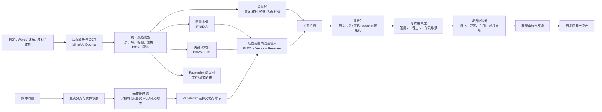

# “活教参”与 PageIndex：调研结论、实现思路和技术方案

> 调研日期：2026-08-05  
> 场景：集团首届人工智能应用创新大赛——教育教学创新应用  
> 样本：九年级上册语文教材、教师教学用书，以及 PageIndex 在线实测会话

## 0. 一句话结论

**PageIndex 值得用，但不建议把它当成整套知识库或唯一检索引擎。**

最适合本项目的方案是：

> **PageIndex 负责“像教师翻目录一样”定位文档和章节；BM25/向量/重排负责在候选章节内找准原文；显式关系层负责连接课程标准—教材—教参—教学活动—评价；证据校验器负责保证每个结论可回到原页。**

这套组合既保留 PageIndex 在长文档结构推理上的优势，又解决它在多文档、精确数字、吞吐量、成本和跨书关系方面的短板。

---

## 1. 产品问题到底是什么

此前讨论的“活教参”并不是一个普通的“上传 PDF 然后聊天”的 RAG 产品。其真正价值是把静态教参转成**可追溯的教学决策系统**，回答以下类型的问题：

1. **事实/解释类**：这篇课文讲什么？某个意象如何理解？
2. **单课决策类**：45 分钟里哪些内容必须教、哪些可以略、如何提问和评价？
3. **单元统整类**：三项任务如何衔接？一篇课文在单元中的功能是什么？
4. **课标对齐类**：属于哪个学习任务群？依据是什么？教学中如何落实？
5. **跨文档影响类**：教材版本变化后，教参、课件、题目、评价表哪些地方需要更新？
6. **教学产物生成类**：生成“一课三卡”、单元教学路线、课堂问题链、评价量规。

因此，核心并非“回答得像不像”，而是：

- 是否找到了**正确层级**的证据；
- 是否区分**原文明确写出**与**模型合理推断**；
- 是否把课程标准、教材、教参放在正确的权威顺序中；
- 教师能否点击答案，回到 PDF 的具体页和原文区域；
- 教师是否能低成本审核、修改并沉淀为下一次可复用的教学资产。

---

## 2. 对提供材料的观察

### 2.1 大赛方向匹配

“活教参”同时命中教育教学创新应用中的：

- 智能教学辅助；
- 智能教材/教辅；
- 智能课程设计；
- 教学资源智能生成。

如果强调出版侧，还可以补充“教材修订影响分析、教参一致性审校、数字教参产品化”，但比赛申报主叙事建议仍放在**教师教学决策**，避免产品边界过宽。

### 2.2 教材和教参天然是树，不是平面文本

九上语文第一单元本身就是明确的任务树：

- 第一单元（活动·探究）
  - 任务一：学习鉴赏
    - 第 3 课《我爱这土地》
  - 任务二：诗歌朗诵
  - 任务三：尝试创作

教师用书又在其上增加：

- 单元目标；
- 编写意图；
- 素养提升；
- 教学指导；
- 单篇课文解读；
- 教学设计；
- 跨篇目比较阅读；
- 活动与评价。

这说明 PageIndex 的“语义目录树”与材料形态很匹配：先定位单元，再定位任务，再定位课文或教学设计，比把 600 多页平均切成固定大小 chunk 更自然。

但材料不仅有上下级关系，还有大量横向关系，例如：

- 《我爱这土地》属于第一单元任务一；
- 任务一为任务二朗诵和任务三创作提供基础；
- 《我爱这土地》可与《乡愁》组成比较阅读；
- 单元目标对应学习任务群要求；
- 某个课堂活动实现某个教学目标；
- 某个评价量规检验某项学习成果。

这些关系**仅靠一棵目录树表达不完整**，需要额外的关系层。

---

## 3. PageIndex 是什么，以及为什么这次实测感觉不错

### 3.1 核心机制

PageIndex 的开源框架大体分为两步：

1. 将长文档转换成带标题、摘要和页码范围的层级树；
2. 让大模型读取树结构，推理应该打开哪些节点/页码，再读取原文回答。

开源示例暴露的关键工具很简单：

- `get_document`：读取文档元数据；
- `get_document_structure`：读取去掉全文后的树结构；
- `get_page_content`：按指定页码或页码范围读取原文。

因此，它的优势不是“更好的向量相似度”，而是把检索过程改成：

> 看书名和目录 → 判断相关章节 → 翻到相关页 → 阅读原文 → 回答。

### 3.2 在本次在线会话中的表现

实测使用的是 612 页教师教学用书，观察到以下优点：

1. **长文档章节定位很好**：对《沁园春·雪》《我爱这土地》等问题能先找到正确章节，再读取相应页段。
2. **容错性不错**：输入“我和我的土地呢”时，能理解用户实际要问《我爱这土地》。
3. **回答可回到页码**：答案附带教参页码，教师容易核查。
4. **适合高层问题**：对于“归属哪个学习任务群、如何落实”这类需要先理解单元结构再组织答案的问题，比纯 top-k chunk 更像人类查书。
5. **生成教学方案的上下文连贯**：能够把单元意图、课文解读、朗读、创作等内容组织成完整课堂设计。

这也是“PageIndex 好像还可以”这一感觉成立的原因：**它非常适合作为长教参的章节级语义路由器。**

---

## 4. 实测同时暴露出的关键问题

### 4.1 它没有读取课程标准，却回答了“2022 课标对应哪个任务群”

当前会话只上传了教师教学用书，没有上传《义务教育语文课程标准（2022 年版）》原文。

PageIndex 回答“文学阅读与创意表达”很可能是正确的，但证据来自教参及教材编写说明，而非课程标准原文。产品中必须明确区分：

- **课标明示**：课程标准原文直接支持；
- **教材/教参明示**：教材或教参直接支持；
- **系统推断**：模型根据材料结构和内容进行归纳；
- **专家确认**：教研员审核确认。

没有课程标准文档时，系统应该提示：

> “根据教参可推断为‘文学阅读与创意表达’，但当前知识库未包含课程标准原文，暂不能给出课标原文级证明。”

而不是把推断包装成已经被课程标准直接验证的事实。

### 4.2 精确数字出现严重失真

教参原文是：

> 任务一 7~8 课时，任务二、三各 1~2 课时。

在线回答显示成：

> 任务一 78 课时，任务二、三各 12 课时。

这不是小问题。教学方案中的课时、页码、比例、题号、年份、分值都属于**高风险字段**。可能原因包括 PDF 文本层、Markdown 渲染、波浪号处理或生成模型复制时丢失符号。

因此，不能只保存清洗后的纯文本。建议同时保留：

- 原始 PDF；
- 页级文本；
- span/token 级原文；
- 坐标框 `bbox`；
- 页面渲染图；
- 规范化文本与原文的字符映射。

对数字、范围、日期、题号、公式等字段，回答前必须做原文字符串校验；不一致时回退到截图或原始 span。

### 4.3 延迟明显

复杂问题中出现了 29 秒、14 秒、41 秒的多轮思考/翻页，总等待约 84 秒后才开始完整回答。对比赛演示可以接受，对日常课堂备课则偏慢。

原因是 PageIndex 检索本身也需要大模型进行树推理，多次读取目录和页段。若每个问题都让大模型从完整大树开始判断，成本和延迟会随树规模、文档数、推理轮数上升。

### 4.4 跨文档能力不能只看单文档演示

当前在线会话只验证了“一个 612 页教参”的效果，并没有验证：

- 课程标准 + 教材 + 教参同时检索；
- 不同版本教材对比；
- 多个独立 PDF 的统一排序和证据合并；
- 某个教材变化对教参和教学资源的影响追踪。

PageIndex 托管 API 已提供多文档检索教程；但开源示例仍主要以单文档 `doc_id` 为单位，跨文件查询需要额外的文档路由和编排。官方文档在讲大规模文档时也明确建议把树推理与向量检索结合，而不是所有文档都直接做全树推理。

### 4.5 PDF 解析本身不是 PageIndex 的核心强项

PageIndex 开源标准路径可回退到 PyPDF2 提取页面文本。对以下材料需要专门的版面/OCR层：

- 扫描版 PDF；
- 双栏或多栏；
- 页眉页脚重复；
- 表格；
- 旁注、图注、活动框；
- 特殊符号、竖排、跨页结构；
- 教材中图文混排和视觉层级。

因此，生产方案不应让 PageIndex 兼任完整文档解析器。应先由 MinerU、Docling 或自有版面分析服务生成结构化 Markdown/JSON，再送入 PageIndex 建树。

---

## 5. PageIndex 的适用性判断

| 能力 | 判断 | 说明 |
|---|---:|---|
| 单本长教参章节定位 | 很适合 | 树结构与教材/教参目录天然匹配 |
| 可解释的检索过程 | 很适合 | 可展示命中的节点、页码和翻页过程 |
| 单篇课文理解 | 适合 | 章节定位后读取连续页段，语境完整 |
| 单元级统整 | 适合 | 可利用上级节点摘要与跨章节阅读 |
| 精确原文/数字复现 | 需增强 | 必须增加 span、bbox 和数字校验 |
| 扫描版和复杂版面 | 需增强 | 应外接专业 PDF/OCR 解析层 |
| 课程标准—教材—教参对齐 | 需增强 | 需要多文档路由和显式关系层 |
| 上万文档、高并发 | 不宜单独承担 | 全树 LLM 推理成本和延迟不可控 |
| 高频简单查询 | 不经济 | BM25/向量直接检索更快更便宜 |
| 教材版本变更影响分析 | 不足 | 需要版本、关系和差异图谱 |

最终定位：

> **PageIndex 是“语义目录和章节路由引擎”，不是完整的知识关系系统，也不是所有问题的唯一检索器。**

---

## 6. 推荐总体架构



### 6.1 为什么要“先 PageIndex，后混合检索”

如果直接在全部 600 页上做向量 top-k，容易命中相似但层级错误的段落；如果每次都让 PageIndex 进行完整树搜索，则慢且贵。

推荐两阶段：

1. **粗路由**：PageIndex 选出 1~3 个相关节点或页码范围；
2. **精检索**：只在这些范围中做 BM25 + 向量 + reranker，找出最能支持具体 claim 的 6~12 个原文块。

这样既保留全局结构，又提高精确引用能力。

### 6.2 什么时候可以跳过 PageIndex

查询分类器可直接选择更便宜的路径：

- 精确课文名、作者名、原句：BM25/元数据查询；
- 某页、某题、某个明确小节：直接定位；
- 高层教学决策、跨章节统整：PageIndex；
- 跨文档课标对齐：PageIndex 文档路由 + 关系扩展 + 混合检索；
- 版本差异：结构化 diff，不让大模型从头“猜差异”。

---

## 7. 数据模型

### 7.1 核心实体

```text
Document
- id
- doc_type: curriculum_standard | textbook | teacher_guide | expert_note
- subject / stage / grade / semester
- edition / revision / publisher / isbn
- file_hash / version / effective_date

Node
- id / document_id / parent_id
- title / summary / level / order
- page_start / page_end
- pageindex_node_id

Block
- id / node_id / page
- block_type: paragraph | heading | table | image | activity | question
- original_text / normalized_text
- bbox / reading_order
- token_start / token_end

Relation
- source_id / target_id / relation_type
- confidence
- evidence_block_ids
- created_by: rule | model | expert
- review_status

Claim
- id / answer_id / claim_text
- claim_type: source_fact | synthesis | inference | recommendation
- confidence

Citation
- claim_id / block_id
- quote_span / page / bbox
- source_authority

TeachingArtifact
- type: board_card | question_card | assessment_card | unit_plan
- lesson_id / version / content
- source_claim_ids
- reviewer / review_status
```

### 7.2 推荐关系类型

- `BELONGS_TO_UNIT`：课文属于单元；
- `BELONGS_TO_TASK`：课文/活动属于任务；
- `IMPLEMENTS_TASK_GROUP`：单元或教学任务落实某学习任务群；
- `EXPLAINED_BY`：教材内容由教参章节解释；
- `HAS_OBJECTIVE`：单元/课文拥有教学目标；
- `REALIZED_BY_ACTIVITY`：目标由活动实现；
- `ASSESSED_BY`：目标由评价任务检验；
- `PREREQUISITE_OF`：任务一是任务二/三的基础；
- `COMPARES_WITH`：两篇课文构成比较阅读；
- `REVISION_IMPACTS`：教材改动影响教参/课件/试题。

MVP 不必一开始上 Neo4j。关系量不大时，PostgreSQL 的关系表、递归查询和 JSONB 足够；只有在关系查询复杂、需要图可视化和多跳探索时再引入图数据库。

---

## 8. 检索与生成的详细链路

### 8.1 文档入库

1. 文件去重：SHA-256 + 版本元数据；
2. PDF 渲染：每页生成图片，保留原始尺寸；
3. OCR/版面解析：标题、正文、表格、图注、框线、阅读顺序；
4. 页眉页脚识别与标记，不直接破坏原文；
5. 生成统一 JSON/Markdown；
6. 构建 PageIndex 树；
7. 对 Block 建 BM25 和向量索引；
8. 用规则 + LLM 提取关系候选；
9. 重要关系由编辑/教研员确认；
10. 运行完整性检查：页数、标题层级、数字范围、乱码率、空白页。

### 8.2 查询分类

推荐分类：

```json
{
  "intent": "curriculum_alignment",
  "entities": {
    "subject": "语文",
    "grade": 9,
    "semester": "上",
    "lesson": "我爱这土地"
  },
  "required_source_types": [
    "curriculum_standard",
    "textbook",
    "teacher_guide"
  ],
  "needs_pageindex": true,
  "needs_relation_expansion": true,
  "risk_level": "high"
}
```

### 8.3 候选文档和章节路由

先用元数据过滤出：

- 2022 版义务教育语文课程标准；
- 九上语文教材目标版本；
- 同版本教师教学用书。

然后让 PageIndex 针对每种文档选择节点，而不是把所有树不加区分地塞给一个 Agent。可以使用“文档路由 Agent + 文档内 PageIndex Agent”两级编排：

```text
Corpus Router
├─ Curriculum Agent
├─ Textbook Agent
└─ Teacher Guide Agent
```

每个子 Agent 返回统一格式：

```json
{
  "document_id": "...",
  "selected_nodes": ["..."],
  "page_ranges": ["13-20", "51-58"],
  "reason": "..."
}
```

### 8.4 范围内混合检索

在 PageIndex 选出的节点范围内：

- BM25 找精确名称、原句、数字；
- 多语向量找语义相近表达；
- Reranker 对候选块重新排序；
- 关系扩展补齐课标、教材和教参证据；
- 相邻块扩展，避免引用断章取义。

一种简单融合方式：

```text
score = 0.35 * bm25_norm
      + 0.30 * vector_norm
      + 0.25 * reranker_norm
      + 0.10 * relation_prior
```

权重不要凭感觉固定，应由 POC 测试集调优。

### 8.5 证据包

传给生成模型的不是一堆无来源文本，而是结构化证据：

```json
{
  "evidence_id": "ev_019",
  "source_type": "teacher_guide",
  "authority": 3,
  "document": "九上语文教师教学用书",
  "version": "2026-07",
  "node_path": ["第一单元", "单元说明", "教学指导"],
  "page": 19,
  "bbox": [72, 188, 510, 240],
  "original_text": "课时安排：任务一 7~8 课时，任务二、三各 1~2 课时。",
  "normalized_text": "课时安排：任务一7~8课时，任务二、三各1~2课时。"
}
```

### 8.6 受约束生成

先输出 JSON，再渲染为自然语言：

```json
{
  "answer": "...",
  "claims": [
    {
      "text": "本课主要对应文学阅读与创意表达学习任务群。",
      "type": "synthesis",
      "evidence_ids": ["ev_cs_12", "ev_tb_08", "ev_tg_03"],
      "inference": false
    }
  ],
  "missing_evidence": [],
  "warnings": []
}
```

如果缺少课程标准，必须输出：

```json
{
  "missing_evidence": ["curriculum_standard"],
  "warnings": ["当前结论由教材与教参推断，尚未由课标原文核验"]
}
```

### 8.7 证据校验器

至少包含：

1. 引用页是否存在；
2. 引用字符串是否能在原文 span 中找到；
3. 数字、范围、年份、题号是否逐字符一致；
4. 每个事实 claim 是否至少有一个证据；
5. “课标规定”是否真的引用课标；
6. 生成建议是否被误写成原文要求；
7. 不同版本材料是否被混用；
8. 结论与证据是否存在明显矛盾。

数字检查示例：

```python
source_numbers = extract_numbers_and_ranges(evidence.original_text)
claim_numbers = extract_numbers_and_ranges(claim.text)
assert claim_numbers <= source_numbers
```

同时把 `~`、`—`、`-`、`至`规范到统一的“范围”语义，但展示时必须回到原始字符。

---

## 9. “一课三卡”和“单元导演”的落地方式

### 9.1 一课三卡

#### 板书卡

- 核心概念；
- 文章结构；
- 意象—意境—情志路径；
- 每个板书节点对应教材/教参证据。

#### 提问卡

每个问题包含：

- 问题；
- 设计意图；
- 预期回答层级；
- 追问；
- 常见误区；
- 证据页；
- 对应教学目标。

#### 评价卡

- 观察点；
- 表现等级；
- 可见学习成果；
- 与任务群/单元目标的对应关系；
- 形成性评价与课后任务。

三卡必须从同一个 `LessonPlanSpec` 生成，避免彼此不一致。

### 9.2 单元导演

单元导演不是生成七份孤立教案，而是先构建：

```text
单元大概念
→ 单元目标
→ 三项任务的递进关系
→ 每篇课文承担的功能
→ 关键学习活动
→ 阶段性成果
→ 评价证据
→ 课时分配
```

例如第一单元：

```text
学习鉴赏 → 诗歌朗诵 → 尝试创作
理解与积累 → 声音化表达 → 创意迁移
```

再将《我爱这土地》的“意象—意境—情志”和家国情怀放入这条单元链路中，而不是单独生成一个看似完整、实际脱离单元任务的教案。

---

## 10. 技术选型建议

### 10.1 MVP 组合

- 文档解析：MinerU 优先试验，Docling 做对照；
- 语义树：PageIndex 开源版，先离线建树；
- 元数据/关系/审核：PostgreSQL；
- 关键词：PostgreSQL FTS 或 Elasticsearch/OpenSearch；
- 向量：pgvector 即可，规模增大后再换专用向量库；
- 中文/多语嵌入：BGE-M3 一类支持 dense/sparse/multi-vector 的模型；
- 重排：BGE reranker 或 API reranker；
- 对象存储：MinIO/S3，保存 PDF、页面图和解析产物；
- 后端：FastAPI；
- 前端：Next.js/React；
- 任务队列：Celery/RQ + Redis；
- 观测：记录每阶段延迟、token、模型、命中节点、证据和审核结果。

### 10.2 模型策略

不建议一开始微调。

先通过以下方式建立基线：

- 强模型用于树构建、复杂路由和最终生成；
- 小模型用于意图分类、实体抽取、格式化和简单校验；
- 嵌入/重排模型用于低成本精检索；
- 规则用于版本、数字、页码和来源权威检查。

只有在积累了足够多的教师审核数据后，再考虑对关系抽取、问题分类或教学产物格式进行微调。

### 10.3 PageIndex 的工程改造点

1. 不在查询时建树，全部离线缓存；
2. 保存树版本与文档 hash，一份文档只重建变化部分；
3. PageIndex Flash 可作为快速结构提取的实验分支，但复杂教材必须与标准路径做准确率对比；
4. 不把完整大树每次都发送给模型，可先按顶层节点裁剪；
5. 维护节点摘要的 token 预算；
6. 对常见问题缓存路由结果；
7. 简单查询绕过 Agent；
8. 多文档采用显式两级编排，不把多个 JSON 树简单拼接；
9. 对模型结构化输出做 Pydantic/JSON Schema 校验和自动重试；
10. 每次查询记录成本、推理轮数、打开页数和最终证据数。

---

## 11. POC 验证方案

### 11.1 必须补充的材料

当前样本缺少最重要的一份权威源：

- 《义务教育语文课程标准（2022 年版）》正式文本。

没有它，不能真正验证“课标—教材—教参”的三源对齐，只能验证教参内问答。

### 11.2 POC 范围

建议只做：

- 九上第一单元；
- 《我爱这土地》为主；
- 加《乡愁》作为跨篇比较；
- 产出一课三卡 + 单元导演的小样；
- 完成课程标准、教材、教参三源引用。

### 11.3 三组对照

- A：PageIndex only；
- B：BM25 + vector + reranker；
- C：PageIndex 路由 + 范围内混合检索 + 关系层 + 证据校验。

目标不是证明某个框架“最好”，而是找出在本项目数据上的最优组合。

### 11.4 测试题分类

至少 80~120 题：

1. 精确定位：某句、某题、某个课时范围；
2. 模糊/错别字：“我和我的土地”；
3. 单篇理解：意象、主旨、结构；
4. 单元统整：任务一到任务三的关系；
5. 课标对齐：任务群与原文要求；
6. 教学决策：45 分钟取舍、问题链、评价；
7. 跨篇比较：《我爱这土地》与《乡愁》；
8. 跨文档：课标—教材—教参证据闭环；
9. 精确数字：“7~8”“1~2”；
10. 不可回答：知识库缺失时能否拒答或提示证据不足；
11. 版本冲突：不同版本材料混入时能否识别；
12. 对抗题：答案听起来合理但材料没有写。

### 11.5 指标

检索指标：

- 正确章节召回率 Recall@k；
- 证据块精确率；
- 页码正确率；
- 跨文档证据完整率。

回答指标：

- claim groundedness；
- 引用支持率；
- 数字/范围正确率；
- 推断标注正确率；
- 教师可接受率；
- 教师修改时间与修改比例。

工程指标：

- p50/p95 延迟；
- 单次查询 token 和成本；
- 索引时间；
- 页面/OCR 错误率；
- 缓存命中率；
- 每个问题打开的页数与 Agent 轮数。

### 11.6 通过门槛建议

- 引用页码正确率 ≥ 98%；
- 数字/范围正确率 = 100%；
- 高风险 claim 必须 100% 有权威证据或明确标记为推断；
- 教师接受或小改后接受率 ≥ 80%；
- 普通问答 p50 < 8 秒，复杂跨文档问题 p95 < 30 秒；
- 缺失课程标准时，系统不得声称已经由课标原文证明。

---

## 12. 六周开发路线

### 第 1 周：数据底座

- 三类文档统一模型；
- PDF 页面渲染与解析；
- 第一单元结构校验；
- 版本和来源权威规则。

### 第 2 周：PageIndex 与基础检索

- 为课标、教材、教参分别建树；
- 建 BM25/向量索引；
- 实现节点—页—Block 的映射；
- 复现并修复 `7~8` 被显示为 `78` 的问题。

### 第 3 周：跨文档关系与证据

- 建立课标—单元—课文—教参—活动—评价关系；
- 关系候选抽取与人工确认界面；
- 实现证据包和 claim-citation 数据结构。

### 第 4 周：应用层

- 完成《我爱这土地》问答；
- 完成一课三卡；
- 完成第一单元导演；
- PDF 原页高亮与来源面板。

### 第 5 周：评测与优化

- 构建 80~120 题测试集；
- 跑 A/B/C 三组对照；
- 优化路由、延迟、缓存和模型组合；
- 增加数字、版本和引用校验。

### 第 6 周：比赛交付

- 打磨演示路径；
- 形成 3 分钟视频和演示脚本；
- 展示“回答—证据—教师审核—生成三卡—沉淀资产”的闭环；
- 汇总效果、效率、成本和可复制性数据。

若距离 9 月底仍有约 8 周，可额外安排 1~2 周做教师试用和迭代。

---

## 13. 比赛演示建议

不要只演示“问一句，AI 答一段”。推荐演示一条完整链路：

1. 教师输入：“《我爱这土地》属于哪个学习任务群？45 分钟怎样落实？”
2. 系统展示三源路由：课程标准、教材、教参；
3. 打开证据面板，显示每个结论的原页和高亮；
4. 明确标记“原文明示 / 系统综合 / 教学建议”；
5. 一键生成板书卡、提问卡、评价卡；
6. 教师修改其中一个问题；
7. 系统同步更新评价卡，保存为校本资源；
8. 最后展示若教材段落更新，哪些教参解释和教学卡片受到影响。

这比普通 PDF Chat 更能体现“AI 原生教学决策系统”的差异。

---

## 14. 最终建议

### 建议采用

- 把 PageIndex 纳入方案；
- 用作长文档章节级路由和可解释导航；
- 对课标、教材、教参分别建树；
- 与元数据、BM25、向量、reranker、关系层、证据校验结合；
- 用真实教师问题建立自己的基准集，不依赖通用或金融 benchmark 判断教育场景效果。

### 不建议

- PageIndex only；
- 把多个文档树简单拼接后交给一个 Agent；
- 只上传教参便声称完成课标对齐；
- 只保存清洗文本，不保存原页与 bbox；
- 未做数字/范围校验就直接生成教学方案；
- 以“回答看起来不错”代替量化评测；
- MVP 阶段上重型知识图谱和大规模微调。

### 最小可行产品定义

> 以九上语文第一单元为样本，基于课程标准、教材、教师教学用书三源证据，准确回答单课和单元教学决策问题，并生成可审核、可追溯、可复用的一课三卡和单元教学方案。

这个范围足够完整，也能在比赛周期内做出可信演示。

---

## 15. 主要外部资料

1. PageIndex 官方仓库：<https://github.com/VectifyAI/PageIndex>
2. PageIndex Framework：<https://docs.pageindex.ai>
3. PageIndex 多文档检索教程：<https://docs.pageindex.ai/tutorials/multi-document-retrieval>
4. PageIndex File System：<https://pageindex.ai/blog/pageindex-file-system>
5. PageIndex Flash：<https://github.com/VectifyAI/PageIndex/tree/main/pageindex/flash>
6. MinerU 官方仓库：<https://github.com/opendatalab/MinerU>
7. Docling 官方仓库：<https://github.com/docling-project/docling>
8. FlagEmbedding / BGE-M3：<https://github.com/FlagOpen/FlagEmbedding>
9. 教育部 2022 年义务教育课程方案和课程标准通知：<https://www.moe.gov.cn/srcsite/A26/s8001/202204/t20220420_619921.html>

> 注：PageIndex 的金融 benchmark 成绩属于官方项目/作者公布结果，可作为能力线索，但不能直接推导其在中文教材、扫描 PDF、跨文档教学决策场景中的效果。最终结论应以本项目测试集为准。
