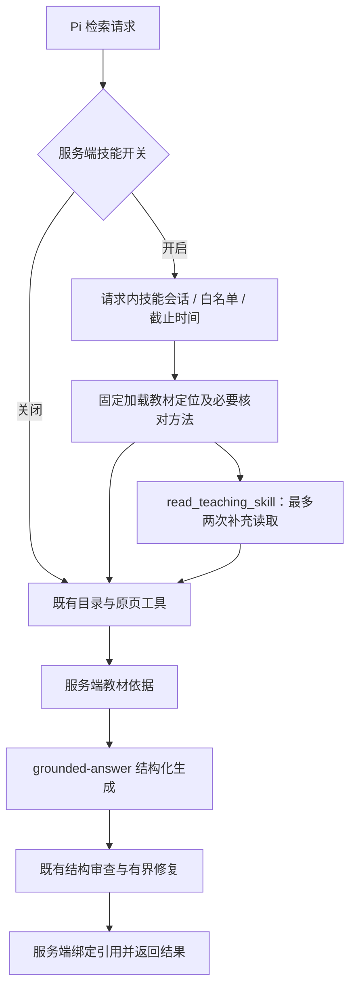

# 产品内教学技能（默认关闭）

这不是开发助手插件。四份随服务端发布的原创工作方法采用 SKILL.md 元信息形式，借鉴 [Agent Skills 格式](https://github.com/agentskills/agentskills/blob/main/docs/specification.mdx) 与 [Pi 按需加载机制](https://github.com/earendil-works/pi/blob/main/packages/coding-agent/docs/skills.md)。未复制第三方技能正文，也不包含浏览器、Shell 或脚本执行能力。

- 开关：仅服务端 `TEACHING_SKILLS_ENABLED=true` 启用；关闭不影响会话恢复修复。
- 每份正文记录版本、来源、内部授权标记；修改方法时同时更新版本及加载器审计记录。
- 检索阶段固定加载教材定位；纠错任务加载原文核对；方案生成加载课堂方案；指定卡片生成加载三卡审校。
- 模型可通过 `read_teaching_skill(skillId)` 读取白名单方法，最多两次工具调用；不接受路径或网址。
- 共用原请求截止时间；不改变现有检索、原页读取和生成修复预算。
- 技能不是教材依据。引用仍绑定检索返回的文档与物理页，不能用技能正文补充课标事实。
- 每个请求独立保存已加载技能与失败原因，重复加载不扩展提示词。
- Vercel 显式打包 `teaching-skills/**/SKILL.md`。预览验收仍需核对实际运行包可读取。

## 对照评估

`evaluation/teaching-skills-cases.json` 定义四篇课文、每篇三类问题共12例。

`RUN_PAID_SKILLS_EVAL=true SKILLS_EVAL_EVIDENCE=<已核对的材料JSON路径> node scripts/evaluate-teaching-skills.mjs`

凭据只从运行环境读取，不写到命令参数或结果。未显式开启不会调用模型。
当前脚本比较同一材料范围下的生成结果，输出必须人工评价；**不替代完整目录检索、连续草稿会话、真实账号隔离及私人 PDF 测试**。没有真实对照结果前，不宣称生成质量提升。

## 与实际代码的连接

图中 `P` 对应 `serverless/pi-retrieval-agent.js`，`S/M/T` 对应 `serverless/teaching-skills.js`，`G/C/B` 对应 `serverless/grounded-answer.js` 及其既有编排模块。生成阶段另按任务加载课堂方案或三卡审校；它们不能替代 `E`。
