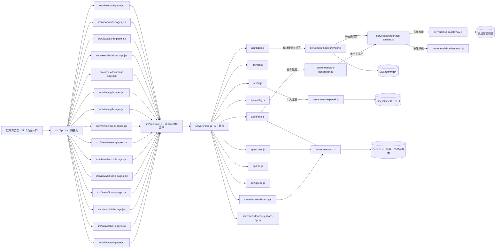

<!-- GENERATED by demo/scripts/generate-code-architecture.mjs. DO NOT EDIT. -->
# 活教参代码架构图

> 本图直接从当前代码生成。运行 `cd demo && npm run docs:architecture` 更新；`npm run check` 会在代码和本图不一致时失败。

## 运行架构

## 页面路由（来自 `src/app-core.js` 与 `vite.config.js`）

| URL | 页面 | 构建入口 |
|---|---|---|
| `/` | 教学任务 | `dashboard` |
| `/guide/` | 备课引导 | `guide` |
| `/unit/` | 单元接力 | `unit` |
| `/cards/` | 一课三卡 | `cards` |
| `/slides/` | 课堂课件 | `slides` |
| `/homework/` | 分层作业 | `homework` |
| `/marking/` | 匿名批改 | `marking` |
| `/rehearsal/` | 问题链预演 | `rehearsal` |
| `/pulse/` | 课前学情摸底 | `pulse` |
| `/worksheet/` | 双页课堂任务单 | `worksheet` |
| `/alignment/` | 课标对齐 | `alignment` |
| `/learning/` | 作业回流 | `learning` |
| `/deliberation/` | 备课取舍 | `deliberation` |
| `/study/` | 一课一研 | `study` |
| `/compare/` | 同课异构 | `compare` |
| `/research/` | 教研问题簿 | `research` |
| `/observation/` | 听评课观察单 | `observation` |
| `/assets/` | 教研资产 | `assets` |
| `/share/` | 教研共备 | `share` |
| `/reflection/` | 课后复盘 | `reflection` |
| `/library/` | 教材库 | `library` |
| `/ask/` | 备课问答 | `ask` |
| `/ingest/` | 导入教材 | `ingest` |
| `/jobs/` | 处理进度 | `jobs` |
| `/inspect/` | 页面校正 | `inspect` |
| `/validation/` | 质量检查 | `validation` |
| `/document/` | 教材原页核验 | `document` |
| `/login/` | 账号登录 | `login` |
| `/settings/` | AI 设置 | `settings` |
| `/decision/` | 教学决策 | `decision` |
| `/pitch/` | 使用示例 | `pitch` |

## 服务端入口（来自 `server/index.js`）

| API 前缀 | 实际处理模块 |
|---|---|
| `/api/upload` | `api/upload.js` |
| `/api/index/documents/upload` | `api/upload.js` |
| `/api/health` | `server/index.js (inline)` |
| `/api/config` | `api/config.js` |
| `/api/auth` | `serverless/auth-proxy.js` |
| `/api/ask` | `api/ask.js` |
| `/api/me` | `api/me.js` |
| `/api/ai` | `api/ai.js` |
| `/api/drafts` | `api/drafts.js` |
| `/api/assets` | `api/assets.js` |
| `/api/shares` | `serverless/teaching-share-api.js` |
| `/api/index` | `api/index.js` |

## 一致性规则

1. 页面 URL 必须同时存在于 `ROUTES` 和 Vite 多页入口。
2. 页面组件通过 `App.jsx` 懒加载，业务请求统一经过 `app-core.js`。
3. 教材页码、教材标识和引用由服务端返回；前端只负责定位与展示。
4. 本文件由代码生成，不作为手工设计假设；新增页面或 API 后必须重新生成。
