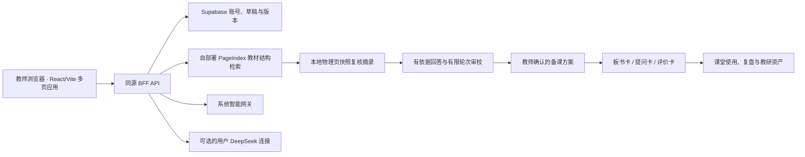

# “活教参”人工智能应用创新大赛参赛计划书

> 项目名称：活教参——基于课标、教材与教师用书证据的 AI 教学决策系统  
> 参赛方向：教育教学创新应用  
> 申报形态建议：AI 产品案例 + 建设方案 + 原型演示  
> 核心样例：义务教育语文九年级上册第一单元《我爱这土地》  
> 版本：V1.1（2026-08-06）  
> 说明：本文只采用大赛通知中明确出现的要求，不虚构评分权重。通知未提供的评分细则、申报书模板字段和网关模型名称统一列入“待确认信息”。

## 一、项目摘要

“活教参”不是一个通用 PDF 问答工具，而是一套面向教师备课、课堂实施和教学资源生产的 AI 教学决策系统。系统将课程标准、学生教材、教师教学用书从静态文档转换为可检索、可关联、可验证的教学证据网络；教师提出“这篇课文属于哪个学习任务群”“45分钟如何取舍”“如何设计问题链和评价”等问题后，系统先按文档结构定位相关章节，再在限定范围内检索原文，最后生成标注证据等级的教学建议和“一课三卡”。

首个演示以九上语文第一单元《我爱这土地》为例，呈现以下闭环：

1. 从课程标准定位“文学阅读与创意表达”学习任务群；
2. 从教材识别“学习鉴赏—诗歌朗诵—尝试创作”的单元任务结构；
3. 从教师用书提取朗读、意象、意境、情感等教学重点；
4. 生成45分钟课堂路径、板书卡、提问卡、评价卡；
5. 对每条结论标注“课标明示 / 教材明示 / 教参明示 / 系统综合”；
6. 点击结论可返回来源文档、章节路径、页码和原文；
7. 对课时、页码、题号、比例等高风险数字执行原文级校验。

核心价值：**教师使用 AI 时，不只得到“看起来合理”的答案，还能确认答案来自哪里、哪些是原文、哪些是系统建议，以及哪些内容必须人工确认。**

## 二、与大赛要求的直接对应

### 2.1 主题对应

大赛主题为“AI赋能教育出版，创新领航智能时代”。本项目同时作用于教育与出版两个环节：

- 教育侧：降低教师备课检索与资源制作成本，支持课堂设计、评价和个性化调整；
- 出版侧：把纸质教材、教参与课程标准转为可计算的内容服务，形成数字教材和智能教辅的新产品形态；
- 集团转型侧：沉淀内容结构、证据关系、教学模板和审核结果，形成可复用的教育出版 AI 基础能力。

### 2.2 参赛类别对应

本项目申报“教育教学创新应用”，对应通知列举的四类场景：

| 通知中的方向 | 本项目对应能力 | 演示证据 |
|---|---|---|
| 智能教学助手 | 辅助教师备课、授课与评价 | 45分钟教学决策、问题链、课堂流程 |
| 智慧教材教辅 | 课标、教材、教参联结为可交互证据网络 | 三源证据检查器、章节路径回溯 |
| 智慧课程设计 | AI 驱动单课与单元任务设计 | 单元导演、任务递进关系 |
| 教学资源智能生产 | 生成板书卡、提问卡、评价卡和情境图 | “一课三卡”、图片网关适配 |

申报叙事应以“智能教学助手”为主线，其他三个方向作为能力延展，避免将项目写成无边界的平台。

### 2.3 应用价值和实际效果对应

通知强调参赛作品要聚焦业务场景，突出应用价值和实际效果。本项目设置可实测指标，不以模型主观评价替代业务效果：

- 备课任务完成时间；
- 教师查找依据所需点击和时间；
- 引用页码、原文和结论的一致率；
- 高风险数字准确率；
- 教师对生成方案的采纳率、修改率和放弃率；
- 教师对“可解释、可控制、可复用”的满意度；
- 同一审核资产被复用的次数；
- 教学内容编辑或教研员审核通过率。

### 2.4 原创、合规与知识产权对应

- 系统方案、关系模型、证据分层、数字校验和交互原型由参赛团队独立设计；
- 使用第三方模型、PageIndex、OCR、向量数据库或其他组件时，在申报书中列出名称、版本、用途、许可证和数据处理边界；
- 不上传保密材料、未授权稿件、学生个人信息或违法内容；
- 教材、教参、课程标准仅在授权范围内用于内部验证和演示；
- AI 生成内容必须显示“AI初稿/待教师审核”；
- 按通知，成果属于职务成果，知识产权归所属单位，团队配合集团展示、宣传和成果转化。

## 三、业务背景与痛点

### 3.1 教师侧

1. **材料多且分散**：课程标准、教材、教师用书、教研资料分别存在，教师要反复翻阅。
2. **时间约束强**：教师真正需要的是“这节课如何取舍”，而不是大段泛化解读。
3. **通用模型缺乏证据边界**：模型可能把常识、推断和原文混写，教师难以快速核查。
4. **生成资源彼此割裂**：教案、板书、提问、评价常由不同工具生成，目标与评价不一致。
5. **成果难复用**：优秀教师的修改与审核结果没有结构化沉淀。

### 3.2 出版与教研侧

1. 教材、教参仍以文件和页码为主要交付形态，内容价值难以持续服务化；
2. 教材版本变更后，教参、课件、题目和数字资源缺少自动影响分析；
3. 教学内容生成需要高强度人工审校，缺少可追溯证据和高风险字段检查；
4. 现有知识库常停留在“切块 + 相似度检索”，无法表达单元、任务、课文、活动、评价之间的关系。

## 四、目标用户、场景与边界

### 4.1 目标用户

- 一线学科教师：备课、授课、作业与评价设计；
- 教研员和学科编辑：方案审核、示范课开发、内容质量控制；
- 数字教育产品人员：把教材内容转化为交互式教学服务；
- 出版内容运营人员：沉淀模板、优质案例和复用资产。

### 4.2 首期场景

- 单篇课文的45分钟教学决策；
- 单元任务统整与课时安排；
- 一课三卡生成；
- 课程标准对齐与证据回溯；
- 关键数字和引用一致性检查。

### 4.3 明确不做

首期不做全学科全学段平台、不替代教师做最终教学判断、不根据学生敏感数据自动决策、不把未经审核的生成内容直接发布给学生、不承诺在没有课程标准原文时提供“课标已验证”结论。

## 五、产品设计

### 5.1 核心页面

1. **教学决策**：输入问题，展示检索路径、决策摘要、分层结论、45分钟流程和数字校验。
2. **一课三卡**：生成可编辑的板书卡、提问卡、评价卡；每张卡显示证据和审核状态。
3. **单元导演**：显示单元大概念、任务递进、课时范围、课文功能和跨课关系。
4. **证据关系**：查看课程标准、教材、教参如何支持教学活动和评价表现。
5. **证据检查器**：显示来源、权威级别、节点路径、页码、原文摘录和结论边界。

### 5.2 关键交互规则

- 原文事实和系统建议使用不同颜色与标签；
- 每条系统综合建议至少关联一条可点击证据；
- 没有某类文档时明确提示“当前知识库缺少该原文”；
- 教师修改内容后保存为“教师确认版本”，不得覆盖原始模型输出；
- 导出材料保留来源清单、生成时间、模型版本和审核人；
- 对数字、页码、年份、题号、比例等字段增加醒目标记和校验状态。

### 5.3 演示主路径

1. 打开“九上语文—第一单元—《我爱这土地》”；
2. 提问“属于哪个学习任务群？45分钟如何落实？”；
3. 系统显示路由：课程标准 → 第一单元 → 任务一 → 课文；
4. 查看四类结论及其原文；
5. 展开45分钟教学路径；
6. 点击生成一课三卡；
7. 打开单元导演，查看三项任务和课时范围；
8. 展示数字校验如何避免 `7~8` 被错误显示成 `78`；
9. 生成课堂情境图，说明图片只作为教学资源草案；
10. 教师审核、修改并导出。

## 六、技术方案

### 6.1 总体架构



本图描述当前已实现链路。页面路由、视图模块和服务端入口的代码级架构图由仓库脚本自动生成，见 [`代码架构图.generated.md`](代码架构图.generated.md)；代码与图不一致时，提交检查会失败。

### 6.2 PageIndex 的角色

PageIndex 用于长文档的章节级语义路由，模拟“看目录—判断章节—翻到相关页”的过程。它适合解决数百页教师用书的结构定位，但不作为唯一检索引擎，原因包括：

- 一棵目录树难以表达跨文档横向关系；
- 精确数字、题号和短词未必适合只靠大模型路由；
- 多用户并发、成本和延迟需要更可控的候选集；
- 路由到章节后仍需精确找到原句。

因此当前实现采用“结构定位 + 物理页复核”：

1. PageIndex 返回候选文档、章节、物理页与排序；
2. 服务端按当前篇目、材料范围和账号权限过滤候选页；
3. 公共教材摘录一律从仓库内已核验物理页快照重建，不直接信任远程聚合片段；
4. 有依据回答在有限轮次内完成草拟、依据检查和课堂可执行性修订；
5. 文档身份、页码和引用链接由服务端绑定，模型不能自行填写。

### 6.3 文档处理

每份 PDF 保留六类数据：

- 原始文件及文件哈希；
- 页级文本；
- 原文 span/token；
- 页面坐标 `bbox`；
- 页面渲染图；
- 规范化文本与原始字符映射。

处理流程：文件登记 → 杀毒/格式检查 → 版面识别 → OCR → 页眉页脚处理 → 目录与标题树识别 → 表格/注释识别 → 人工抽检 → 版本发布。

### 6.4 关系模型

核心实体：课程标准条目、学习任务群、学段要求、教材册次、单元、任务、课文、知识点、教学目标、活动、问题、评价标准、教学资源。

核心关系示例：

- `课文 属于 单元任务`
- `单元任务 对齐 学习任务群`
- `教学活动 实现 教学目标`
- `评价条目 检验 学习表现`
- `教师用书章节 解释 教材内容`
- `教学资源 来源于 证据片段`
- `版本变更 影响 资源`

关系层首期可采用 PostgreSQL 表或轻量图结构，不必因“图谱”概念过早引入复杂图数据库。

### 6.5 检索与生成

检索分四级：

1. **意图识别**：事实查询、课标对齐、单课决策、单元统整、资源生成；
2. **结构路由**：按书、册、单元、任务、课文缩小范围；
3. **页级定位**：PageIndex 返回候选物理页，本地快照补足课程标准并复核公共教材摘录；
4. **证据整理**：按材料角色、篇目一致性、物理页有效性和问题相关性组织回答。

生成使用结构化中间结果，而不是直接让模型自由写教案：

```json
{
  "claim": "结论文本",
  "claim_type": "standard_explicit | textbook_explicit | guide_explicit | synthesis",
  "evidence_ids": ["e1", "e3"],
  "teacher_review_required": true,
  "risk_fields": ["duration"]
}
```

### 6.6 证据与可靠性

- **权威层级**：课程标准 > 审定教材 > 配套教师用书 > 专家审核资产 > 系统综合；
- **直接性**：原文直接表述优先于跨段归纳；
- **冲突处理**：发现版本或内容冲突时并列展示，不自动择一；
- **引用校验**：生成后从原始页面重新定位引用，检查字符串和页码；
- **数字校验**：对 `7~8`、`1~2` 等数字范围执行正则提取、原文对比和渲染检查；
- **越界检测**：答案出现证据中没有的专名、数字或结论时，标记为“未获证据支持”。

### 6.7 模型网关接入

网关通过服务端适配，浏览器永远不接触密钥。环境变量：

- `LLM_GATEWAY_BASE_URL`
- `LLM_GATEWAY_API_KEY`
- `LLM_TEXT_MODEL`
- `LLM_IMAGE_MODEL`
- `LLM_IMAGE_ENDPOINT`

文字模型通过 OpenAI 兼容的 `/v1/chat/completions` 接口接入。图片模型名称和接口路径尚未确认，因此原型只提供可配置适配器，不在文档中虚构模型。服务端记录请求 ID、模型名、延迟和错误，不记录完整密钥；涉及教材原文的日志做最小化和脱敏。

### 6.8 图片生成

图片生成用于课堂导入图、概念图草案、活动背景图，不生成或仿制教材插图。上线前需：

- 明确图片模型及使用许可；
- 设置禁止内容和敏感内容审核；
- 保留提示词、模型、时间和审核状态；
- 对人物肖像、商标、既有插画风格模仿设置限制；
- 明示“AI生成/教师审核”；
- 确认是否允许生成内容进入正式出版物。

## 七、创新点

1. **从文档问答升级为教学决策**：围绕课堂取舍、活动和评价输出，而非只总结内容。
2. **三源证据联结**：课程标准、教材、教参共同约束答案，避免单一教参替代课标。
3. **事实—推断分层**：原文明示与系统综合在数据结构和界面上都分开。
4. **结构路由 + 精确检索**：PageIndex 处理长文档结构，混合检索处理原句和数字。
5. **高风险字段校验**：把课时、页码、题号等从普通文字中独立出来核验。
6. **教师审核资产化**：教师修改不只是一次性结果，而是可追踪、可复用的组织资产。
7. **出版内容服务化**：把纸质内容结构、关系和教学意图转为可持续迭代的数字能力。

## 八、原型现状与可用性

当前 Demo 已实现：

- 固定样例的完整可点击主路径；
- 三源证据、四类结论标签；
- 原文证据检查器；
- 45分钟课堂流程；
- 一课三卡；
- 单元导演与课时范围；
- 数字风险校验演示；
- 服务端网关配置与样例模式降级；
- 本地 JSON 导出；
- 图片生成配置入口与本地演示画面。

当前未实现或为原型替代：

- 尚未接入全量 PageIndex 构建服务；
- 尚未建立生产向量库、重排模型和关系数据库；
- 尚未确认网关的文字/图片模型名称与图片接口契约；
- 尚未实现登录、角色权限、审计和正式内容安全流程；
- 生成的45分钟方案和一课三卡是证据约束下的演示结果，不代表专家审核通过。

## 九、试点与评测方案

### 9.1 试点范围

建议选择九上语文第一单元，邀请 8—15 名一线教师、2—3 名教研员/编辑参与。用同一批真实备课任务对比“现行方式”和“活教参辅助方式”。

### 9.2 任务集

- 10个事实/解释问题；
- 10个课标对齐问题；
- 10个单课45分钟决策问题；
- 5个单元统整问题；
- 10个高风险数字与页码问题；
- 5套一课三卡生成任务。

### 9.3 指标定义

| 指标 | 定义 | 原型目标（待试点校准） |
|---|---|---|
| 引用准确率 | 引用文本、页码和来源完全一致的比例 | ≥95% |
| 高风险数字准确率 | 数字/范围与原文一致的比例 | 100% |
| 无依据断言率 | 无证据支持却写成事实的结论占比 | ≤2% |
| 首次可用率 | 教师判断“稍改即可用/直接可用”的产物占比 | ≥70% |
| 备课时间节省 | 与现行方式相比的中位数下降幅度 | ≥30% |
| 证据核查时间 | 完成一次结论核查的中位时间 | ≤30秒 |

上述数字是项目试点目标，不是大赛评分标准。完成基线测试后应据实更新。

### 9.4 评测方法

- 双人独立标注 + 分歧仲裁；
- 事实正确性与教学适切性分开评分；
- 原始输出、教师修改和最终采纳版本分别保存；
- 统计平均值同时报告中位数、分布和失败案例；
- 对失败案例按检索、OCR、模型生成、证据映射、交互误导分类。

## 十、实施计划（截至2026年9月30日）

### 阶段1：原型闭环（8月6日—8月12日）

- 固化参赛定位和单一主场景；
- 完成可点击 Demo、证据样例和数字校验；
- 建立比赛要求符合性矩阵；
- 确认团队、申报主体和材料模板。

**里程碑**：可进行 8—10 分钟现场演示。

### 阶段2：真实文档管线（8月13日—8月23日）

- 完成三类文档登记、OCR、页码和版面数据；
- 构建 PageIndex 结构树；
- 建立章节内混合检索；
- 实现证据 ID、原文坐标和页面预览。

**里程碑**：新问题能从真实文档检索而非只读样例。

### 阶段3：关系与可靠性（8月24日—9月4日）

- 建立课标—教材—教参—活动—评价关系；
- 实现引用回查、数字校验和无依据断言检查；
- 接入网关文字模型；
- 在接口确认后接入图片模型。

**里程碑**：完成首轮30题正确性测试和失败分析。

### 阶段4：教师试用（9月5日—9月14日）

- 组织教师和编辑试用；
- 记录完成时间、采纳率、修改率与问题；
- 优化交互、提示词和证据呈现；
- 形成2—3个教师确认案例。

**里程碑**：形成试点数据和用户反馈证据。

### 阶段5：参赛材料（9月15日—9月24日）

- 完成基本信息表和参赛申报书；
- 录制演示视频；
- 完成架构图、测试报告、知识产权与第三方组件清单；
- 准备现场演示脚本和备用离线版本。

**里程碑**：所有材料进入内部审校。

### 阶段6：审校与提交（9月25日—9月30日）

- 业务、技术、法务/版权、保密四类审查；
- 修复阻断问题；
- 按公司二维码完成登记；
- 在9月30日前提交基本信息表、参赛申报书和可选支撑材料；
- 保存提交回执和最终版本哈希。

## 十一、团队建议

通知鼓励跨部门、跨业务组队。建议最小团队：

| 角色 | 主要职责 |
|---|---|
| 项目负责人/产品 | 参赛统筹、场景边界、需求和演示 |
| 学科编辑/教研专家 | 证据审核、教学适切性、评测标准 |
| AI/检索工程师 | PageIndex、检索、重排、证据校验 |
| 全栈工程师 | 工作台、服务端、网关、导出 |
| 数据/测试 | 文档处理、题集、指标和失败分析 |
| 合规/版权支持 | 数据授权、第三方清单、展示边界 |

人手不足时可由成员兼任，但“技术正确性”和“教学适切性”不应由同一人单独验收。

## 十二、资源与预算估算

原型阶段优先使用现有网关和本地环境。预算以实际采购审批为准：

- 模型调用：按问题量、上下文长度和图片生成次数测算；
- 文档解析/OCR：按页数和是否含复杂版面测算；
- 计算与存储：应用服务、数据库、对象存储、日志；
- 专家评审：教师、教研员试用与标注工时；
- 演示材料：视频录制、现场设备和备用网络。

申报书中不应在缺少网关计费和部署报价时填写伪精确金额，应先用“调用量 × 单价 + 基础资源”形成可追溯测算表。

## 十三、风险与应对

| 风险 | 影响 | 应对 |
|---|---|---|
| OCR 或文本层丢失符号 | 课时等数字失真 | 保留页面图、字符映射；数字专项校验 |
| 模型把推断写成原文 | 误导教师 | 强制 claim_type；无证据断言检测 |
| 只上传教参却宣称课标对齐 | 权威性不足 | 三源缺一时明确提示，不做原文级证明 |
| PageIndex 路由错误 | 找错章节 | 按篇目重排并用已核验物理页快照复核；允许教师切换章节 |
| 教材和教参版本不一致 | 引用冲突 | 文件哈希、版次元数据、冲突并列展示 |
| 网关模型或接口变化 | Demo 中断 | 模型和端点配置化；提供离线证据样例 |
| 生成图片版权风险 | 无法用于出版 | 限制用途、保留来源、人工审核、确认许可 |
| 教师过度依赖 AI | 教学质量风险 | 明示 AI 初稿；教师确认后才能入库/导出正式版 |
| 进度过宽 | 9月30日前无法闭环 | 只保九上语文第一单元主路径，其他作为扩展 |
| 现场网络不稳定 | 演示失败 | 本地可运行、固定样例和录屏三重备份 |

## 十四、交付物清单

### 必交

- 人工智能应用创新大赛基本信息表；
- 参赛申报书。

### 建议支撑材料

- 可运行产品 Demo；
- 8—10分钟演示视频；
- 参赛计划书；
- 比赛要求符合性矩阵；
- 技术架构与数据流图；
- 第三方工具、模型、数据与许可证清单；
- 测试题集、测试报告和失败案例；
- 教师/编辑试用反馈；
- 原创性与保密审查记录；
- 一页式项目简介和现场答辩脚本。

## 十五、8分钟演示脚本

1. **0:00—0:40 痛点**：教师面对课标、教材、教参，真正难的是把依据转成45分钟决策。
2. **0:40—1:20 产品定位**：活教参不是聊天机器人，而是有证据的教学决策工作台。
3. **1:20—2:40 主问题**：输入《我爱这土地》的学习任务群与课堂落实问题。
4. **2:40—3:40 三源证据**：展示课标、教材、教参结论和原文回溯。
5. **3:40—4:40 教学落地**：展示45分钟流程和一课三卡。
6. **4:40—5:30 单元统整**：展示任务一、二、三的递进关系。
7. **5:30—6:30 可靠性**：展示 `7~8`、`1~2` 数字校验，解释为什么普通问答不够。
8. **6:30—7:20 技术**：PageIndex 路由 + 混合检索 + 关系层 + 校验器。
9. **7:20—8:00 价值**：教师节省时间，出版内容服务化，审核资产持续沉淀。

## 十六、待确认信息

1. 大赛正式申报书和基本信息表模板字段；
2. 所属公司内部初评细则及是否存在未随通知发布的评分表；
3. 参赛单位、部门、负责人、团队成员与联系方式；
4. 公司二维码报名的具体操作路径和内部截止时间；
5. 网关可用的文字模型名称；
6. 网关图片模型名称、接口路径、请求/返回结构和计费；
7. Demo 部署环境、访问范围和网络策略；
8. 教材、教参及课程标准用于内部演示、录屏和评审材料的授权边界；
9. AI 图片能否进入申报材料或正式出版物；
10. 试点教师与教研员名单、试用时间和数据采集授权。

这些信息不影响本地原型运行，但会影响网关真接入、正式申报书、公开演示和生产部署。
